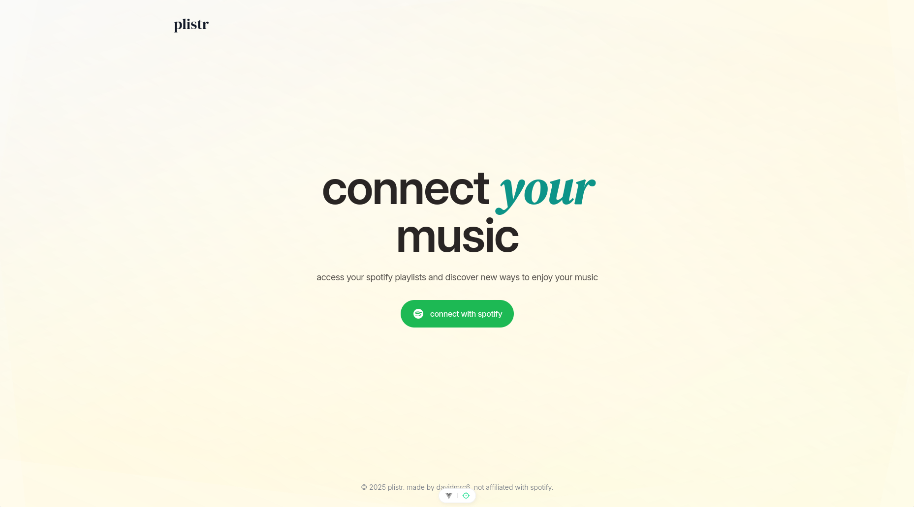
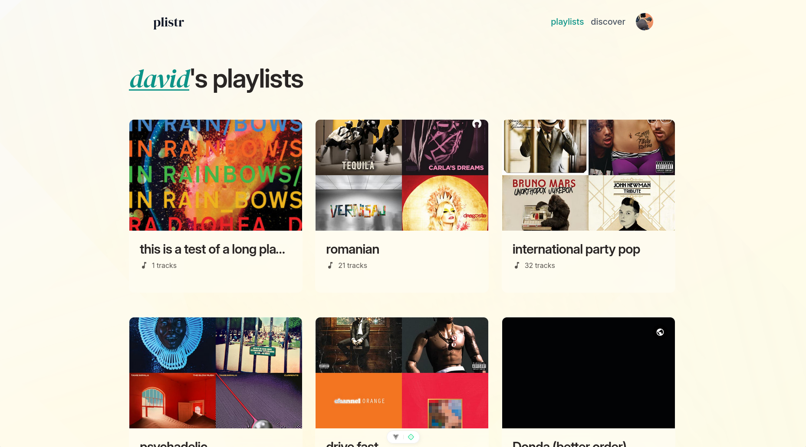
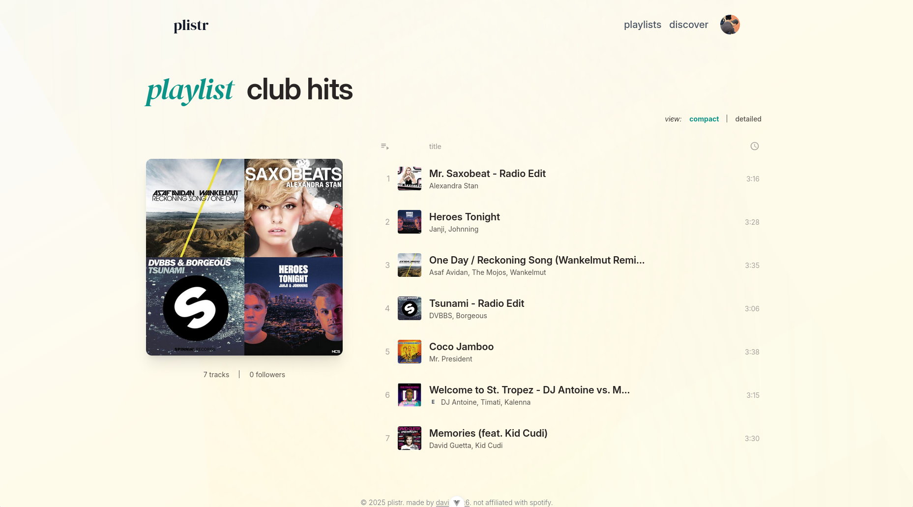

# plistr

A web application for viewing, sorting, and adding new music to your Spotify playlists. Built on top of the
[Spotify Web API](https://developer.spotify.com/documentation/web-api).

## Overview

plistr is a modern web application that helps Spotify users manage their playlists more effectively. The application is built using Vue 3 and TypeScript, providing a robust and type-safe development environment.

> **Note:** The main idea behind this web application was to allow users to sort and visualize their playlists based
> on the `audio-features` endpoint provided by the [Spotify Web API](https://developer.spotify.com/documentation/web-api).
> It was during development when I found out that this endpoint is actually deprecated, rendering that feature
> impossible to implement for now. This is why I will stop actively working on this application unless I can find
> a similar alternative, which I find quite unlikely at this moment in time.

## What is plistr?

plistr is your personal Spotify playlist management companion. It provides an intuitive interface for managing your Spotify playlists, making it easier to organize your music collection. Whether you're a casual listener or a music enthusiast, plistr helps you keep your playlists organized and discover new ways to enjoy your music.

## Screenshots







## Setup

1. Clone the repository:
   ```bash
   git clone https://github.com/yourusername/plistr-vue.git
   cd plistr-vue
   ```

2. Install dependencies:
   ```bash
   npm install
   ```

3. Create a `.env` file in the root directory with your Spotify API credentials:
   ```
   VITE_SPOTIFY_CLIENT_ID=your_client_id
   VITE_SPOTIFY_CLIENT_SECRET=your_client_secret
   VITE_SPOTIFY_REDIRECT_URI=your_redirect_uri
   ```

4. Start the development server:
   ```bash
   npm run dev
   ```

## Contributing

Contributions are welcome! Please feel free to submit a Pull Request.

## License

This project is licensed under the MIT License - see the LICENSE file for details.

## Acknowledgments

- [Spotify Web API](https://developer.spotify.com/documentation/web-api)
- [Vue.js](https://vuejs.org/)
- [Vite](https://vitejs.dev/)
